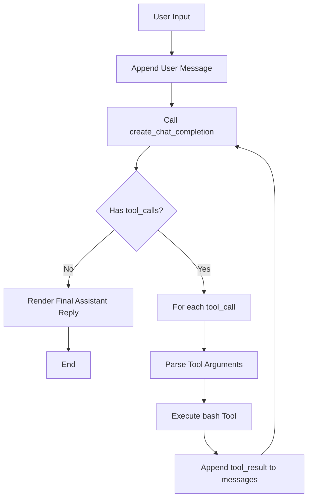

# v01: The Agent Loop（智能体循环）

`[ v01 ] v02 > v03 > v04 > v05 > v06 | v07 > v08 > v09 > v10 > v11 > v12`

> *"One loop + one tool is enough"*  
> 一个循环 + 一个工具，就能跑通最小可用智能体。

## 背景与目标

LLM 本身擅长推理，但默认无法直接访问本地环境（读文件、执行命令、获取真实报错）。  
`v01` 的目标是实现最小闭环：**模型发起工具调用 -> 程序执行工具 -> 结果回填给模型 -> 模型继续决策**。

## 核心机制

`agent_loop()` 是整个版本的核心：  
只要模型持续返回 `tool_calls`，就继续执行并把 `tool_result` 追加到 `messages`；当不再有工具调用时，循环结束并输出最终答复。

### Mermaid 流程图



## 代码结构（`agents/v01_agent_loop.py`）

1. 加载环境变量并初始化 `OpenAI` 客户端（基于 `LLM_*` 配置）。
2. 读取 `prompts/v01_agent_loop.md` 并注入 `{workspace}`。
3. 注册单一工具 `bash`（函数调用 schema）。
4. 启动循环：
   - 调用 `client.chat.completions.create(...)`
   - 渲染 assistant 输出
   - 若无 `tool_calls`，退出循环
   - 若有 `tool_calls`，执行工具并回填结果到 `messages`

## 关键函数速览

- `parse_args()`：解析 CLI 参数（`--max-turns`、`--tool-preview-chars`、`--thinking`、`--show-thinking`）
- `create_chat_completion()`：兼容不同 provider 的 thinking 参数
- `parse_tool_arguments()`：解析并校验工具参数 JSON
- `run_bash()`：执行命令，并做基础危险命令拦截
- `agent_loop()`：维护 assistant/tool 循环和终止条件

## 运行方式

```sh
python agents/v01_agent_loop.py
```

可选参数示例：

```sh
python agents/v01_agent_loop.py --max-turns 30 --tool-preview-chars 500
python agents/v01_agent_loop.py --thinking on --show-thinking
```

## 快速验证提示词

1. `List all Python files in this project.`
2. `Show git status and summarize staged changes.`
3. `Create a file hello.py that prints Hello, World!`
4. `Run tests and tell me why they fail.`
