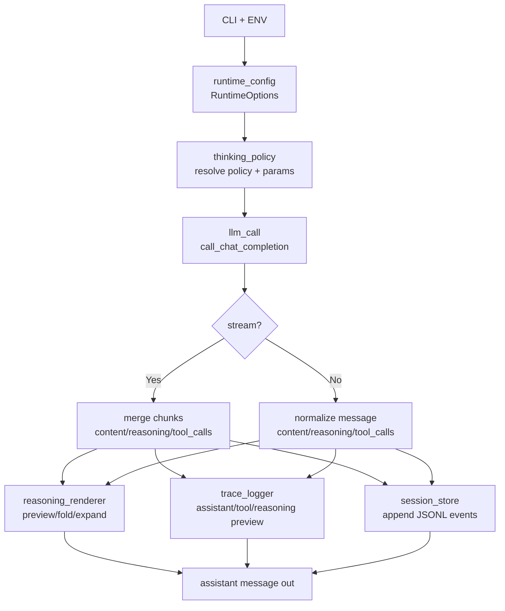
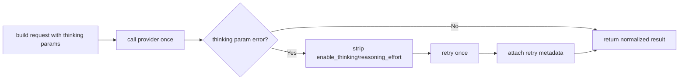

# utils

运行时模块集合，涵盖配置解析、LLM 调用、reasoning 展示、日志与会话保存。

## 模块说明

| 文件 | 作用 | 关键点 |
| --- | --- | --- |
| `runtime_config.py` | 统一解析 CLI + ENV | 输出 `RuntimeOptions`；提供 `add_runtime_args(parser)` |
| `thinking_policy.py` | 处理 thinking 能力与策略 | 支持 `auto/toggle/always/never`；生成 `enable_thinking`/`reasoning_effort` |
| `llm_call.py` | 统一 LLM 调用入口 | 兼容 stream/non-stream；返回 `assistant_content`/`assistant_reasoning`/`tool_calls`/`raw_metadata`；失败时可去参重试 |
| `reasoning_renderer.py` | reasoning 展示与交互 | 预览、折叠、下展（快捷键 `r`） |
| `trace_logger.py` | LLM 响应日志控制 | 输出 assistant/tool/reasoning 摘要 |
| `session_store.py` | 会话落盘 | JSONL 格式；文件名 `<model>_<YYYYMMDD_HHMMSS>.jsonl` |

## 模块设计逻辑

1. `runtime_config.py` 负责把 CLI 与环境变量合并成统一运行时配置，保证各 Agent 入口拿到同一种 `RuntimeOptions`。
2. `thinking_policy.py` 根据模型能力探测和用户模式（`auto/on/off`）生成最终 thinking 请求参数，屏蔽 provider 差异。
3. `llm_call.py` 是唯一 LLM 调用门面，统一处理：请求构建、流式与非流式返回归一化、tool_calls 合并、thinking 参数失败回退。
4. `reasoning_renderer.py` 只负责展示层逻辑：流式预览、超限折叠、用户按需展开，不参与模型请求决策。
5. `trace_logger.py` 负责可控日志摘要，便于调试，不改变业务数据。
6. `session_store.py` 负责事件持久化（meta/assistant/tool），用于回放和排障。
7. `__init__.py` 统一导出公共 API，作为外部调用的稳定入口。

## 主流程图

## `llm_call` 内部回退流程（thinking 参数）

