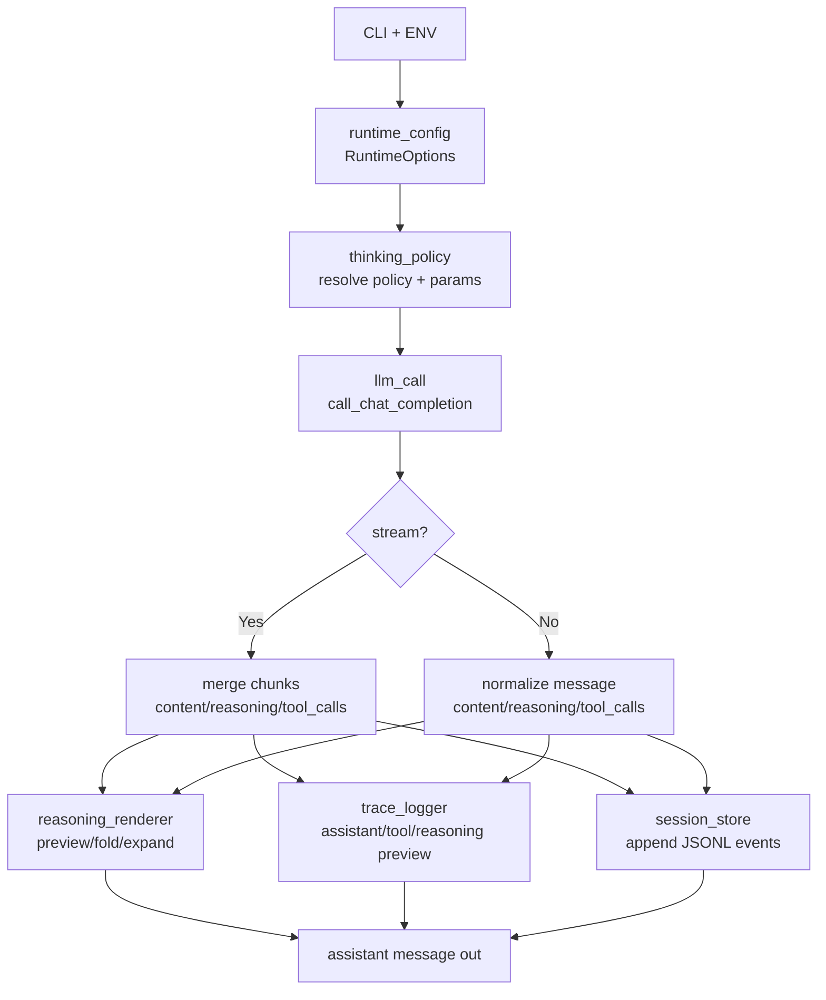
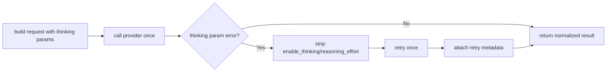

# utils

运行时模块集合，涵盖配置解析、LLM 调用、reasoning 展示、日志与会话保存。

## 模块说明

| 文件 | 作用 | 关键点 |
| --- | --- | --- |
| `runtime_config.py` | 统一解析 CLI + ENV | 输出 `RuntimeOptions`；提供 `add_runtime_args(parser)` |
| `thinking_policy.py` | 处理 thinking 能力与策略 | 支持 `auto/toggle/always/never`；生成 `enable_thinking`/`reasoning_effort` |
| `llm_call.py` | 统一 LLM 调用入口 | 兼容 stream/non-stream；返回 `assistant_content`/`assistant_reasoning`/`tool_calls`/`raw_metadata`；失败时可去参重试 |
| `reasoning_renderer.py` | reasoning 展示与交互 | 预览、折叠、下展（快捷键 `r`） |
| `trace_logger.py` | LLM 响应日志控制 | 输出 assistant/tool/reasoning 摘要 |
| `session_store.py` | 会话落盘 | JSONL 格式；文件名 `<model>_<YYYYMMDD_HHMMSS>.jsonl` |

## 模块设计逻辑

1. `runtime_config.py` 负责把 CLI 与环境变量合并成统一运行时配置，保证各 Agent 入口拿到同一种 `RuntimeOptions`。
2. `thinking_policy.py` 根据模型能力探测和用户模式（`auto/on/off`）生成最终 thinking 请求参数，屏蔽 provider 差异。
3. `llm_call.py` 是唯一 LLM 调用门面，统一处理：请求构建、流式与非流式返回归一化、tool_calls 合并、thinking 参数失败回退。
4. `reasoning_renderer.py` 只负责展示层逻辑：流式预览、超限折叠、用户按需展开，不参与模型请求决策。
5. `trace_logger.py` 负责可控日志摘要，便于调试，不改变业务数据。
6. `session_store.py` 负责事件持久化（meta/assistant/tool），用于回放和排障。
7. `__init__.py` 统一导出公共 API，作为外部调用的稳定入口。

## 主流程图


```mermaid
flowchart TD
    A[CLI + ENV] --> B[runtime_config\nRuntimeOptions]
    B --> C[thinking_policy\nresolve policy + params]
    C --> D[llm_call\ncall_chat_completion]

    D --> E{stream?}
    E -->|Yes| F[merge chunks\ncontent/reasoning/tool_calls]
    E -->|No| G[normalize message\ncontent/reasoning/tool_calls]

    F --> H[reasoning_renderer\npreview/fold/expand]
    G --> H

    F --> I[trace_logger\nassistant/tool/reasoning preview]
    G --> I

    F --> J[session_store\nappend JSONL events]
    G --> J

    H --> K[assistant message out]
    I --> K
    J --> K
```

## `llm_call` 内部回退流程（thinking 参数）


```mermaid
flowchart LR
    A[build request with thinking params] --> B[call provider once]
    B --> C{thinking param error?}
    C -->|No| D[return normalized result]
    C -->|Yes| E[strip enable_thinking/reasoning_effort]
    E --> F[retry once]
    F --> G[attach retry metadata]
    G --> D
```

## 调用方式指导（详细）

本节提供一套可直接落地的调用方式，覆盖：

1. 环境变量准备
2. CLI 参数接入
3. thinking 策略解析
4. `llm_call` 非流式/流式调用
5. reasoning 展示、日志、会话落盘
6. 一个可运行的端到端模板

### 1) 环境变量约定

最小必需（由你的业务入口读取并构造 client）：

- `LLM_API_KEY`
- `LLM_BASE_URL`（可选，兼容代理网关或自建服务）
- `LLM_MODEL`

`utils/runtime_config.py` 读取的运行时控制变量：

- `AGENT_SHOW_LLM_RESPONSE`：`true/false`
- `AGENT_STREAM`：`true/false`
- `AGENT_THINKING_MODE`：`auto/on/off`
- `AGENT_REASONING_EFFORT`：`none/low/medium/high`
- `AGENT_REASONING_PREVIEW_CHARS`：整数
- `AGENT_SAVE_SESSION`：`true/false`
- `AGENT_SESSION_DIR`：目录路径
- `AGENT_THINKING_CAPABILITY`：`auto/toggle/always/never`
- `AGENT_THINKING_PARAM_STYLE`：`auto/enable_thinking/reasoning_effort/both`

示例：

```bash
export LLM_API_KEY="sk-xxxx"
export LLM_BASE_URL="https://api.openai.com/v1"
export LLM_MODEL="gpt-4o-mini"

export AGENT_STREAM="true"
export AGENT_THINKING_MODE="auto"
export AGENT_REASONING_EFFORT="medium"
export AGENT_SHOW_LLM_RESPONSE="true"
export AGENT_SAVE_SESSION="true"
export AGENT_SESSION_DIR="sessions"
```

### 2) CLI 参数接入

`runtime_config.add_runtime_args(parser)` 会自动挂载以下参数：

- `--show-llm-response / --no-show-llm-response`
- `--stream / --no-stream`
- `--thinking {auto,on,off}`
- `--reasoning-effort {none,low,medium,high}`
- `--reasoning-preview-chars <int>`
- `--save-session / --no-save-session`
- `--session-dir <path>`

推荐入口写法：

```python
import argparse
import os
import sys

sys.path.append(os.getcwd())

from utils.runtime_config import add_runtime_args, runtime_options_from_args


def parse_args():
    """Parse CLI arguments.

    Args:
        None.
    """
    parser = argparse.ArgumentParser(description = "LLM runtime demo")
    parser.add_argument("--prompt", required = True)
    add_runtime_args(parser = parser)
    return parser.parse_args()


def main():
    """Main entry.

    Args:
        None.
    """
    args = parse_args()
    runtime_options = runtime_options_from_args(args = args)
    print(runtime_options.as_dict())


if __name__ == "__main__":
    main()
```

### 3) thinking 策略解析

两步：

1. `resolve_thinking_policy(...)` 决定当前模型支持方式（`toggle/always/never` 等）
2. `build_thinking_params(...)` 根据用户模式构建本次请求参数

```python
from utils.thinking_policy import resolve_thinking_policy, build_thinking_params

policy = resolve_thinking_policy(
    client = client,
    model = model,
    capability_setting = runtime_options.thinking_capability,
    param_style_setting = runtime_options.thinking_param_style,
)

thinking_params = build_thinking_params(
    policy = policy,
    thinking_mode = runtime_options.thinking_mode,
    reasoning_effort = runtime_options.reasoning_effort,
)
```

### 4) `llm_call` 调用方式

#### 非流式

```python
from utils.llm_call import call_chat_completion

result = call_chat_completion(
    client = client,
    model = model,
    messages = [{"role": "user", "content": prompt}],
    stream = False,
    thinking_params = thinking_params,
)

print(result.assistant_content)
print(result.assistant_reasoning)
print(result.tool_calls)
print(result.raw_metadata)
```

#### 流式

```python
from utils.llm_call import call_chat_completion

content_chunks = []
reasoning_chunks = []

result = call_chat_completion(
    client = client,
    model = model,
    messages = [{"role": "user", "content": prompt}],
    stream = True,
    thinking_params = thinking_params,
    on_content_chunk = content_chunks.append,
    on_reasoning_chunk = reasoning_chunks.append,
)
```

`llm_call` 内部会在检测到 thinking 参数不兼容时报错信号时，自动去掉 `enable_thinking/reasoning_effort` 并重试一次。

### 5) reasoning 展示、日志与会话落盘

#### reasoning 展示

```python
from utils.reasoning_renderer import ReasoningRenderer

renderer = ReasoningRenderer(
    preview_chars = runtime_options.reasoning_preview_chars,
)

for chunk in reasoning_chunks:
    renderer.handle_stream_chunk(chunk = chunk)

renderer.finalize_turn(
    full_reasoning = result.assistant_reasoning,
    stream_mode = runtime_options.stream,
    allow_expand_prompt = True,
    interactive = True,
)
```

#### 响应日志

```python
from utils.trace_logger import TraceLogger

trace_logger = TraceLogger(enabled = runtime_options.show_llm_response)
trace_logger.log_turn(
    actor = "assistant",
    assistant_content = result.assistant_content,
    tool_calls = result.tool_calls,
    assistant_reasoning = result.assistant_reasoning,
)
```

#### 会话落盘（JSONL）

```python
from utils.session_store import SessionStore

store = SessionStore(
    enabled = runtime_options.save_session,
    model = model,
    session_dir = runtime_options.session_dir,
    runtime_options = runtime_options.as_dict(),
)

store.record_assistant(
    actor = "assistant",
    content = result.assistant_content,
    reasoning = result.assistant_reasoning,
    tool_calls = result.tool_calls,
    raw_metadata = result.raw_metadata,
)
```

### 6) 端到端最小模板（可直接改造）

```python
import os
import sys
import argparse

from openai import OpenAI

sys.path.append(os.getcwd())

from utils.runtime_config import add_runtime_args, runtime_options_from_args
from utils.thinking_policy import resolve_thinking_policy, build_thinking_params
from utils.reasoning_renderer import ReasoningRenderer
from utils.trace_logger import TraceLogger
from utils.session_store import SessionStore
from utils.llm_call import call_chat_completion


def parse_args():
    """Parse CLI arguments.

    Args:
        None.
    """
    parser = argparse.ArgumentParser(description = "Utils end-to-end demo")
    parser.add_argument("--prompt", required = True)
    add_runtime_args(parser = parser)
    return parser.parse_args()


def main():
    """Main entry.

    Args:
        None.
    """
    args = parse_args()
    runtime_options = runtime_options_from_args(args = args)

    client = OpenAI(
        api_key = os.getenv("LLM_API_KEY"),
        base_url = os.getenv("LLM_BASE_URL") or None,
    )
    model = os.getenv("LLM_MODEL", "gpt-4o-mini")

    policy = resolve_thinking_policy(
        client = client,
        model = model,
        capability_setting = runtime_options.thinking_capability,
        param_style_setting = runtime_options.thinking_param_style,
    )
    thinking_params = build_thinking_params(
        policy = policy,
        thinking_mode = runtime_options.thinking_mode,
        reasoning_effort = runtime_options.reasoning_effort,
    )

    trace_logger = TraceLogger(enabled = runtime_options.show_llm_response)
    store = SessionStore(
        enabled = runtime_options.save_session,
        model = model,
        session_dir = runtime_options.session_dir,
        runtime_options = runtime_options.as_dict(),
    )
    renderer = ReasoningRenderer(
        preview_chars = runtime_options.reasoning_preview_chars,
    )

    result = call_chat_completion(
        client = client,
        model = model,
        messages = [{"role": "user", "content": args.prompt}],
        stream = runtime_options.stream,
        thinking_params = thinking_params,
        on_reasoning_chunk = lambda chunk: renderer.handle_stream_chunk(chunk = chunk),
    )

    renderer.finalize_turn(
        full_reasoning = result.assistant_reasoning,
        stream_mode = runtime_options.stream,
        allow_expand_prompt = True,
        interactive = True,
    )

    trace_logger.log_turn(
        actor = "assistant",
        assistant_content = result.assistant_content,
        tool_calls = result.tool_calls,
        assistant_reasoning = result.assistant_reasoning,
    )
    store.record_assistant(
        actor = "assistant",
        content = result.assistant_content,
        reasoning = result.assistant_reasoning,
        tool_calls = result.tool_calls,
        raw_metadata = result.raw_metadata,
    )

    print(result.assistant_content)


if __name__ == "__main__":
    main()
```

推荐命令：

```bash
python your_entry.py --prompt "解释一下这个仓库的 utils 设计" --stream --thinking auto --reasoning-effort medium --save-session
python your_entry.py --prompt "给我一个三步学习计划" --no-stream --thinking off
```
